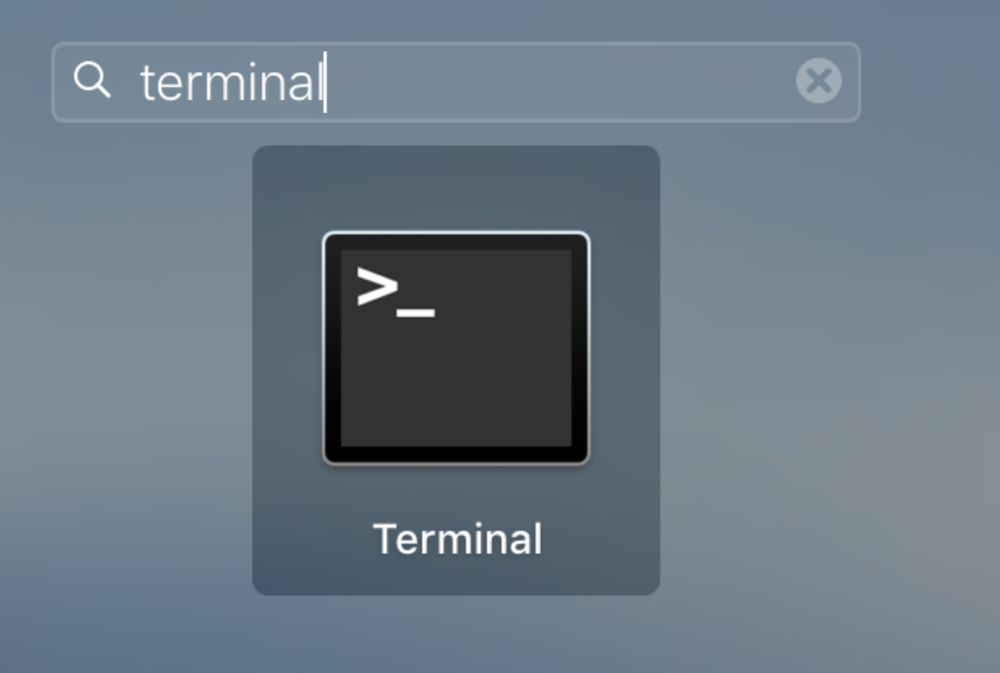
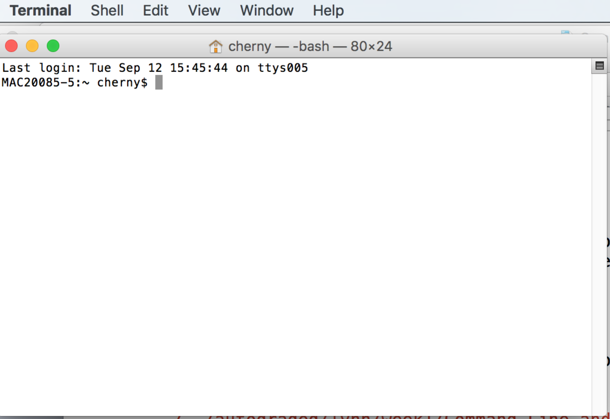
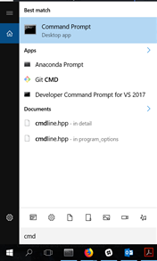
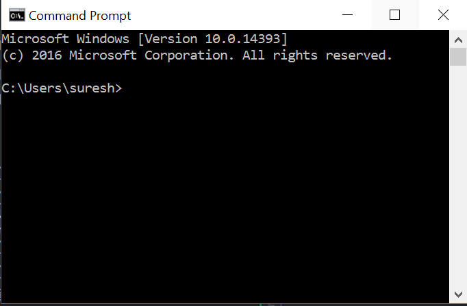

# Command Line and Unix Introduction

Programming requires a number of tools and knowledge that aren&#39;t obvious when you start learning a language like Python.  All the online books won&#39;t help you if you don&#39;t get your environment set up and well understood in the long term.

To write and run programs on your machine (not in a Jupyter notebook) you will need a &quot;plain text&quot; editor.  This means a tool for text that does not do formatting like Word does.

- On Windows, you can use Notepad or Notepad++.  You might eventually want a real programming tool but Notepad++ will get you pretty far.

- On Mac, you should download Sublime Text 2 or 3 (you can use the trial) or Atom.

**Terminal Windows/Shell CMD Window**

You need to know your way around your file system and the terminal window because these will come up pretty quickly.  Understanding the file system is #1 priority, because you can&#39;t do anything in code (including web html/css) without being able to understand file paths.

Open a Terminal window on Mac. In Launchpad, search for &quot;Terminal.&quot;

Try typing &quot;ls&quot; and then &quot;return&quot; and see what you get.  You&#39;re on your way.

Open a command prompt on Windows. Click on search , type &quot;CMD.&quot;

Try typing &quot;dir&quot;,this command will display all the files and folders in the current directory, and then type &quot;cls&quot; and see what happens.

On Windows, install the linux bash shell if on Windows 10 (e.g., [https://www.howtogeek.com/249966/how-to-install-and-use-the-linux-bash-shell-on-windows-10/](https://www.howtogeek.com/249966/how-to-install-and-use-the-linux-bash-shell-on-windows-10/)) or win-bash ( [http://win-bash.sourceforge.net/](http://win-bash.sourceforge.net/)) or Cygwin (last resort, much larger to install).

This window is different than the CMD window on windows, because it has a smarter command system that understand some Unix.  Try typing &quot;ls&quot; here too.

**In Class Crash Course:**

Software Carpentry lessons – DO THE FIRST FOUR (including Pipes and Filters).

[https://swcarpentry.github.io/shell-novice/01-intro/](https://swcarpentry.github.io/shell-novice/01-intro/)

Extra documents that might help:

Bash guide: [https://github.com/Idnan/bash-guide](https://github.com/Idnan/bash-guide)

Linux Terminal Introduction:

[https://www.howtogeek.com/140679/beginner-geek-how-to-start-using-the-linux-terminal/](https://www.howtogeek.com/140679/beginner-geek-how-to-start-using-the-linux-terminal/)

Bash shell on Windows – install and use:

[https://www.howtogeek.com/249966/how-to-install-and-use-the-linux-bash-shell-on-windows-10/](https://www.howtogeek.com/249966/how-to-install-and-use-the-linux-bash-shell-on-windows-10/)

Info on File commands in Unix (you can ignore chmod and ln):

[https://www.howtogeek.com/107808/how-to-manage-files-from-the-linux-terminal-11-commands-you-need-to-know/](https://www.howtogeek.com/107808/how-to-manage-files-from-the-linux-terminal-11-commands-you-need-to-know/)

Tutorial videos

Working with directories and files on mac

[https://www.youtube.com/watch?time\_continue=661&amp;v=Vhcx4KJbtes](https://www.youtube.com/watch?time_continue=661&amp;v=Vhcx4KJbtes)

Working with directories in CMD windows

[https://www.youtube.com/watch?v=MNwErTxfkUA](https://www.youtube.com/watch?v=MNwErTxfkUA)

Working with directories in UNIX

[https://www.youtube.com/embed/cX9ASUE3YAQ?s](https://www.youtube.com/embed/cX9ASUE3YAQ?start=174&amp;end=1080) [tart=174&amp;end=1080](https://www.youtube.com/embed/cX9ASUE3YAQ?start=174&amp;end=1080)
