# Python and the Jupyter Notebook

## Installation of Python

We recommend the Anaconda distribution from Continuum Analytics.

**Installation for MAC:**

[https://www.continuum.io/downloads](https://www.continuum.io/downloads)

You should install the version for Python 3.5.

**Installation guide for windows**

[https://conda.io/docs/user-guide/install/windows.html](https://conda.io/docs/user-guide/install/windows.html)

In the Anaconda navigator, you will use the Jupyter Notebook.

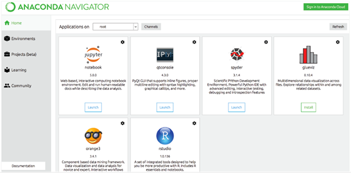

If you ever have any problems launching it from here, you can also do it from a command window/terminal, where you type “jupyter notebook”:

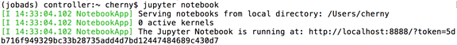

It will open a web browser with the contents of your current working directory.

To close the notebook server, you must type Control-C twice in the window with the server code running!  Otherwise, leave this window alone while you work.

This is the notebook view while it is running – this is essentially a file browser.  You can only open a notebook file (.ipynb extension) from this window.  You cannot double click on a notebook file to open it without this server running.

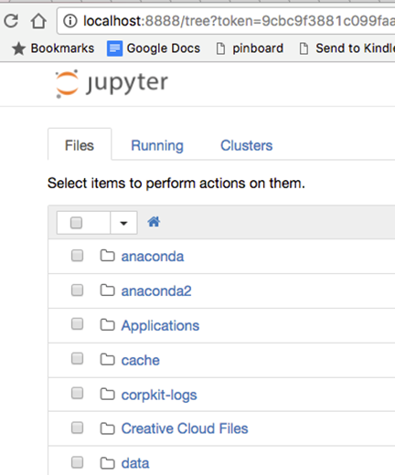

The Jupyter Notebook Intro

Although you can write code in a text editor and run it at the command line, it’s simpler and more fun to use the Jupyter Notebook, which runs in your web browser.  You will also use the Notebook to do your homework.

Watch this video for an overview of how to use the notebook:  

[https://www.youtube.com/watch?v=DLWBfR2hxoo&feature=youtu.be](https://www.youtube.com/watch?v=DLWBfR2hxoo&feature=youtu.be)

You can also review this:

[https://nbviewer.jupyter.org/github/ipython/ipython/blob/3.x/examples/Notebook/Notebook%20Basics.ipynb](https://nbviewer.jupyter.org/github/ipython/ipython/blob/3.x/examples/Notebook/Notebook%20Basics.ipynb)

### Finding a Notebook and Opening It

If you start the notebook from the Anaconda Navigator, it will show you the list of folders (“directories”) at the top of your User Directory, to start with.  If you need to find the User directory on your machine, try clicking on your hard drive, and finding USER or Users, and your name under it.  On my Mac, it’s here where you see “cherny” and the house icon:

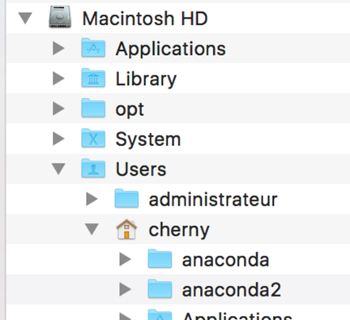

I dragged the “house” icon to my favorites to make it easier to find it.

When you start up the notebook, you will see a tab in your browser showing the contents of the current folder (usually your top level directory under “Users”).  It might look like this:

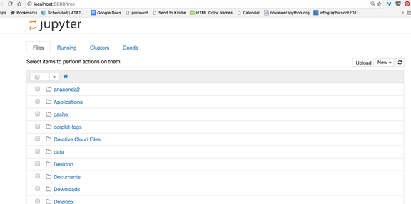

Each of those folder icons can be clicked on to navigate to a new location.

Wherever you are (meaning, in whatever folder/directory you are) when you click the NEW button on the right side to create a new notebook is the location that notebook will be saved in.   You should do NEW > Python 3 for a new python notebook.

The notebook will show your folders and files based on where you start the notebook server from.  If you use the command line to start the notebook from inside a specific folder, you will see those files.  It will also save new notebooks there.  You can click on a folder name (or create one using the NEW button) to navigate to where you want to save your notebook.

This is also how you will find your notebooks for the homework assignments.

Here I have navigated into the course file and here is the Week1 notebook:

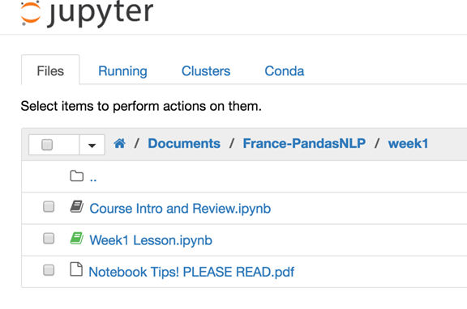

### Create a New Notebook

When you need to or want to create a new notebook you will use the NEW button on the right side – pick Python [root] or Python 3, if it shows that.  (You will be editing the notebooks we give you for the homework, though.  But you can do scratch work in a new one if you want.)

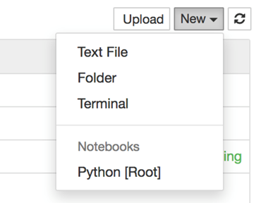

### Using the Notebook for Code

- Add a new “cell” to the notebook with the + icon
    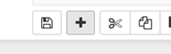

- “Run” or evaluate a cell by clicking in the cell and pressing SHIFT-ENTER (at the same time)  (it will display any results and create a new empty cell).
- 	To see values of variables or print, you can either put a variable alone in a cell and execute it, or use  a “print(var)” statement (replacing “var” with the name of your variable).  In this example, we defined var as the string of characters “hi” and then we checked it by using 2 methods, evaluating it in a cell (2, which has the output below in “Out[2]”) and by printing it (3).
  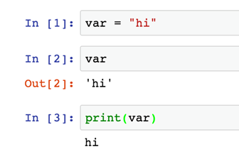

### Text Cells in the Notebook
You can create text in the notebook too.  For example, do this by typing “Question 1” in a new cell, and then changing the type at the top using the dropdown menu that shows “Code” by default.  Change it to Markdown.  The style of the cell will change.  You still need to evaluate it with “shift-enter” or the run button.

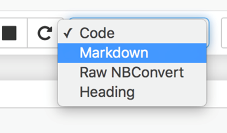

After you evaluate this cell (click shift-enter, or the run button) using markdown (or Heading), you will see it change into plain text:

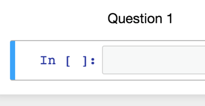

### The Notebook Files You Turn In

Save your work using the save button on the notebook toolbar:

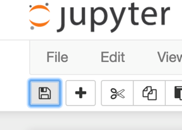

**DO NOT SAVE THE NOTEBOOK FILE FROM THE WEB BROWSER FILE MENU.**

The notebook, when you save it, will be a file ending in “.ipynb”.  You will submit this as your homework each week.

If you started the notebook from the Anaconda dialog, your notebook files will be in the root directory for your operating system.  If you navigated into a folder before you opened the file or created it, it will be in the directory you navigated to.

The root directory, if you did not navigate somewhere, is your folder under “Users” or “User” and your name.

On Windows, this is wherever your User directory is.  Click on your C drive and navigate to it.  Look for the files that end with “.ipynb” at the end.

On Mac, this is probably the top of your Users directory too.  Use the finder to navigate.

If you really can’t find your file on your hard drive, you need to ask us for help using your computer.  Another option is to download the file from the FILE menu on the notebook and download it as Notebook (.ipynb) format.  Then find that file in Downloads and upload that to the Dropbox.

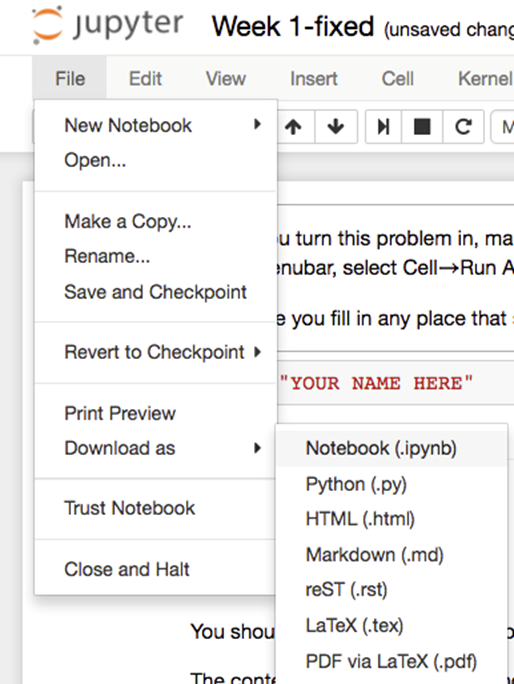

Upload the Week1.ipynb file to the Dropbox.   Do not upload an HTML or json file.

Do not change the file name.  Put your name inside the first cell on top that asks for your name!

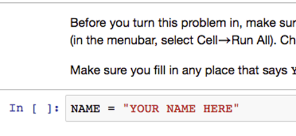

Installing Python Packages

If you get an error during import of something (such as import collections or import math), it means a package isn’t installed yet.  That shouldn’t happen in this course, but probably will.  (For instance, “mock” isn’t installed by default and is needed for the grading.)

Open a terminal window/CMD . It must be a new terminal window (“nouvelle fenetre”) not the one that is showing the code for the notebook that is running….

For instance, try “conda install seaborn”:

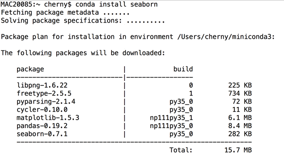

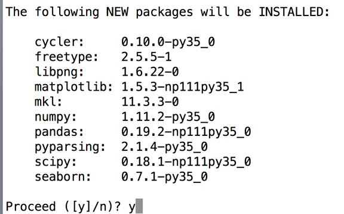

Type “y” and it will install for you.

Now you will be able to “import seaborn” when we need it.

You should do this with “conda install mock” as well.

If a “conda install <packagename>” fails… you can try “pip install <packagename>” instead.  The packages may not all be listed in the conda online repository, but most of them are in “pip.”  We prefer conda because they work best with Anaconda.

If these commands don’t work for you, there is a path problem on your laptop with your installation of Anaconda.  The command/terminal window is not able to find the “conda” or “pip” command.  Something was not done right with your install.  You will have to ask us for help.

There is also a way to use Anaconda to install new packages, which you can try:
[https://docs.anaconda.com/anaconda/navigator/getting-started#finding-and-installing-a-package](https://docs.anaconda.com/anaconda/navigator/getting-started#finding-and-installing-a-package
)
